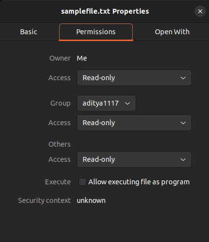

# Errors in Python
Errors in Python are abnormal conditions that interrupt the normal program execution. In this article, we will discuss the different types of errors and exceptions in Python. We will also discuss how you can avoid Python errors effectively. 


## What are the different types of errors in Python?
We can broadly categorize Python errors into four types.

1. Syntax errors: Syntax errors occur due to invalid syntax, incorrect indentation, or typos. These errors are detected before execution of the program.
2. Runtime errors: Runtime errors occur during program execution when the Python interpreter encounters an invalid operation.
3. Logical errors: Logical errors are caused due to error in the logic of the program when the code runs without error but produces incorrect results.
4. System level errors: System level errors are raised by the Python runtime environment or the operating system due to reasons like memory overflow or interruptions.
5. File and I/O errors: These errors are a subset of system level errors that occur during file operations or input/output tasks.

Let's discuss all these errors one-by-one in detail, starting with syntax errors.

## Syntax Errors in Python

Syntax errors are the errors caused by invalid code structure, typos, incorrect indentation, etc. For example an `if block` is defined in Python using the `if` keyword, a boolean condition, and the `:` character. If we skip `:` while writing an if block in Python, the code runs into SyntaxError with the message `SyntaxError: expected ':'`, as shown in the following example:

```py
if x > 10
    print("HoneyBadger")
```
This code gives the following error message:

```py
File "/home/aditya1117/codes/HoneyBadger/python-errors/code.py", line 1
    if x > 10
             ^
SyntaxError: expected ':'
```
Syntax errors occur when the interpreter cannot parse the code because it violates Python’s grammar rules and syntax errors are detected while the interpreter parses the code. Let's discuss some of the common syntax errors.

### Indentation error
Python uses spaces and tabs for indentation in the code blocks. The code will run into IndentationError if any code block doesn't have correct indentation. For example, defining an if blocks requries us to indent the lines in the if block to the right by two/four spaces. If we don't indent the lines in the if block, the code runs into  IndentationError with the message `IndentationError: expected an indented block after 'if' statement on line 1`.

```py
if x > 10:
print("HoneyBadger")
```
The unindented if block gives the following error:

```py
  File "/home/aditya1117/codes/HoneyBadger/python-errors/code.py", line 2
    print("HoneyBadger")
    ^
IndentationError: expected an indented block after 'if' statement on line 1
```
Similarly, we need to indent the code block inside a function definition. Not doing so, gives us an Indentation error with the message `IndentationError: expected an indented block after function definition on line 1`, as shown below:

```py
def say_hello(name):
print(f"Hi {name}, you are at HoneyBadger")
    
```
In this code, the print statement inside the say_hello function isn't indented to the right. Hence, the code gives the following error:

```py
File "/home/aditya1117/codes/HoneyBadger/python-errors/code.py", line 2
    print(f"Hi {name}, you are at HoneyBadger")
    ^
IndentationError: expected an indented block after function definition on line 1
```
When you indent a code block, it is important to keep the indentation same for each statement in the code block. Otherwise, the program runs into indentation error. For example, if you use the first statement of a code block by four spaces and the second statement by two spaces, the program will run into IndentationError with the message `IndentationError: unindent does not match any outer indentation level`, as shown in the following example:

```py
def say_hello(name):
    print(f"Hi {name}, you are at HoneyBadger")
  print("Great seeing you here.")
```
Output:
```py
  File "/home/aditya1117/codes/HoneyBadger/python-errors/code.py", line 3
    print("Great seeing you here.")
                                   ^
IndentationError: unindent does not match any outer indentation level
```
Similary, if you indent the first statement in a code block by two spaces and the second statement by four spaces, the program will run into IndentationError with the message `IndentationError: unexpected indent`, as shown below:

```py
def say_hello(name):
  print(f"Hi {name}, you are at HoneyBadger")
    print("Great seeing you here.")
```
Output:

```py
  File "/home/aditya1117/codes/HoneyBadger/python-errors/code.py", line 3
    print("Great seeing you here.")
IndentationError: unexpected indent
```
Hence, it is important to keep same indentation for every statement in a code block.

### Tab error
TabError is a specific indentation error caused by mixing tabs and spaces to indent code blocks. For instance, you can indent a statement by the same distance using four spaces or one tab. Visually, it looks the same. However, if you indent a statement in a code block using tab and another using four spaces, the program will run into TabError with the message `TabError: inconsistent use of tabs and spaces in indentation`, as shown in the following example:

```py
def say_hello(name):
	print(f"Hi {name}, you are at HoneyBadger") # Indentation using Tab
    print("Great seeing you here.")  # Indentation using four spaces

```
Output:
```py
  File "/home/aditya1117/codes/HoneyBadger/python-errors/code.py", line 3
    print("Great seeing you here.") # Indentation using four spaces
TabError: inconsistent use of tabs and spaces in indentation
```

Python 3 explicitly disallows mixing tabs and spaces for indentation in a way that makes the meaning ambiguous, and you should always avoid it.

### Unclosed strings/ brackets
A Python program runs into SyntaxError if you don't close a string, parentheses, or bracket. For example, if you don't close a string, the program runs into  SyntaxError with the message `SyntaxError: unterminated string literal`.

```py
if x > 10:
    print("HoneyBadger)
```
In this code, the closing `"` is missing in the `"HoneyBadger` string. Due to this, the program runs into SyntaxError exception, as shown below:

```py
  File "/home/aditya1117/codes/HoneyBadger/python-errors/code.py", line 2
    print("HoneyBadger)
          ^
SyntaxError: unterminated string literal (detected at line 2)
```
Similarly, if we forget a parentheses while calling a function or defining a tuple, the program runs into SyntaxError with the message `SyntaxError: '(' was never closed`, as shown below:

```py
print("HoneyBadger"
```
Output:

```py
  File "/home/aditya1117/codes/HoneyBadger/python-errors/code.py", line 1
    print("HoneyBadger"
         ^
SyntaxError: '(' was never closed
```
Just like the parentheses, if we miss the ending bracket while defining a list, the program runs into SyntaxError with the message `SyntaxError: '[' was never closed`, as shown below:

```py
my_list=[1,2,3
```
Output:

```py
  File "/home/aditya1117/codes/HoneyBadger/python-errors/code.py", line 1
    my_list=[1,2,3
            ^
SyntaxError: '[' was never closed
```

### Invalid assignment errors
Invalid assignment errors are mostly caused to due to assigning values to literals or function calls. For example, we we assign the value `"HoneyBadger"` to a string literal `"name"`, the program runs into SyntaxError with the message `SyntaxError: cannot assign to literal here. Maybe you meant '==' instead of '='?`, as shown below:

```py
"name"="HoneyBadger"
```

Output:

```py
  File "/home/aditya1117/codes/HoneyBadger/python-errors/code.py", line 1
    "name"="HoneyBadger"
    ^^^^^^
SyntaxError: cannot assign to literal here. Maybe you meant '==' instead of '='?
```
Similary, if we assign a value to a Python keyword, the program runs into SyntaxError. For example, assigning the value `HoneyBadger` to a variable `class` leads results in SyntaxError exception with the message `SyntaxError: invalid syntax` as `class` is a Python keyword.

```py
class="HoneyBadger"
```

Output:

```py
  File "/home/aditya1117/codes/HoneyBadger/python-errors/code.py", line 1
    class="HoneyBadger"
         ^
SyntaxError: invalid syntax
```
Assignment error also occur when we miss a `=` character while comparing values using the equality operator. For example, if we use `=` instead of `==` to compare two values, the program runs into SyntaxError exception with the message `SyntaxError: invalid syntax. Maybe you meant '==' or ':=' instead of '='?`, as shown below:

```py
name="HoneyBadger"
input_string="HoneyBadger"
if name=input_string:
  print(name)
```
Output:

```py
  File "/home/aditya1117/codes/HoneyBadger/python-errors/code.py", line 3
    if name=input_string:
       ^^^^^^^^^^^^^^^^^
SyntaxError: invalid syntax. Maybe you meant '==' or ':=' instead of '='?
```

### How to avoid syntax error in Python? 

Syntax errors occur due to incorrect indentation, mismatched delimiters, missing punctuation, invalid variable names, or incorrect operators. You can avoid syntax errors using the following best practices:

- Add required colons `:` after block statements like `if`, `for`, `while`, `def`, and `class`.
- Avoid using reserved keywords such as `class`, `for`, `if`, or `return` as variable names.
- Close all parentheses `()`, brackets `[]`, and braces `{}`.
- Close all string literals with matching quotation marks `'` or `"`.
- Follow Python syntax rules and ensure statements are written in the correct format.
- Maintain consistent indentation, preferably using 4 spaces per indentation level and do not mix tabs and spaces for indentation.

Along with the above practices, you can use IDEs or code editors like PyCharm, Spyder, or VS Code that provide syntax highlighting and linting to detect syntax issues early.

## Runtime errors
Runtime errors occur after the program passes the syntax check, starts executing, and something goes wrong. Examples of runtime errors include ZeroDivisionError, NameError, TypeError, and ValueError. Let's discuss the different runtime errors, their causes, and ways to avoid them. 

### Zero division error
ZeroDivisionError is one of the most common arithmetic error that occurs if the denominator of a division operation is zero. 

```py
x = 10 / 0
```
Here, we are dividing ten by zero. Hence, the program runs into ZeroDivisionError with the message `ZeroDivisionError: division by zero`:

```py
Traceback (most recent call last):
  File "/home/aditya1117/codes/HoneyBadger/python-errors/code.py", line 1, in <module>
    x = 10 / 0
ZeroDivisionError: division by zero
```

### NameError
The NameError exception occurs when a variable is referenced before assignment.

```py
y=x/10
```
In this code, we tried to divide `x` by 10 without defining the variable `x` or assigning it any value. Hence, the variable name `x`  isn't present in the scope of the program, and the program runs into NameError exception with the message `NameError: name 'x' is not defined` when the statement is executed.

```py
Traceback (most recent call last):
  File "/home/aditya1117/codes/HoneyBadger/python-errors/code.py", line 1, in <module>
    y=x/10
NameError: name 'x' is not defined
```
The NameError exception occurs also if you use a variable first and define it later in the program. For example, consider the following code:
```py
print(greeting)
greeting="Hi, you are at HoneyBadger"
```
Here, we have referenced the variable `greeting` and later assigned it a value. However, the program still runs into the NameError exception.

```py
Traceback (most recent call last):
  File "/home/aditya1117/codes/HoneyBadger/python-errors/code.py", line 1, in <module>
    print(greeting)
NameError: name 'greeting' is not defined
```

### UnboundLocalError

The UnboundLocalError exception occurs when a local variable is referenced before assignment. For instance, consider the following code:

```py
def say_hello():
	print(greeting)
	greeting="Hi, you are at HoneyBadger"

say_hello()
```
In this code, we have referenced the `greeting` before assigning it any value in the `say_hello()` function. When we call the say_hello() function, the program runs into `UnboundLocalError` exception with the message `UnboundLocalError: local variable 'greeting' referenced before assignment`. 

```py
Traceback (most recent call last):
  File "/home/aditya1117/codes/HoneyBadger/python-errors/code.py", line 5, in <module>
    say_hello()
  File "/home/aditya1117/codes/HoneyBadger/python-errors/code.py", line 2, in say_hello
    print(greeting)
UnboundLocalError: local variable 'greeting' referenced before assignment
```
Here, if we hadn't assigned any value to the variable after the print statement, the program would have run into NameError exception, as shown below:

```py
def say_hello():
	print(greeting)
	print("Hi, you are at HoneyBadger")

say_hello()
```
Output:

```py
Traceback (most recent call last):
  File "/home/aditya1117/codes/HoneyBadger/python-errors/code.py", line 5, in <module>
    say_hello()
  File "/home/aditya1117/codes/HoneyBadger/python-errors/code.py", line 2, in say_hello
    print(greeting)
NameError: name 'greeting' is not defined
```
### TypeError
TypeError exceptions occur when an operation is applied to a value or variable of incompatible data types. For example, adding an integer and a string results in TypeError exception with the error message `TypeError: unsupported operand type(s) for +: 'int' and 'str'`, as shown below:

```py
x=10+"HoneyBadger"
```
Output:

```py
Traceback (most recent call last):
  File "/home/aditya1117/codes/HoneyBadger/python-errors/code.py", line 1, in <module>
    x=10+"HoneyBadger"
TypeError: unsupported operand type(s) for +: 'int' and 'str'
```
Similarly, calling a non callable object or iterating a non-iterable object also results in a TypeError exception, as shown below:

```py
name="HoneyBadger"
name()
```
Output:

```py
Traceback (most recent call last):
  File "/home/aditya1117/codes/HoneyBadger/python-errors/code.py", line 2, in <module>
    name()
TypeError: 'str' object is not callable
```
In the above code, we defined a string variable `name` and tried to use it as a function in the second line. Hence, the program runs into TypeError exception with the message `TypeError: 'str' object is not callable`. Thus, TypeError exception occurs everytime we apply an operation or function to a variable or value of incompatible data type.

### ValueError

ValueError exception occurs when we use a value or a variable with correct data type but inappropriate value. For instance, the int() function converts a string to an integer. If the string passed to the int() function cannot be converted into an integer, the program runs into ValueError exception, as shown in the following example:

```py
x=int("10")
y=x+int("HoneyBadger")
print(y)
```
In this code, the state `x=int("10")` executes successfully as `"10"` is successfully converted into an integer. However, the string `"HoneyBadger"` cannot be converted into an integer. Hence, the second line of the code raises ValueError exception with the message `ValueError: invalid literal for int() with base 10: 'HoneyBadger'`, as follows:

```py
Traceback (most recent call last):
  File "/home/aditya1117/codes/HoneyBadger/python-errors/code.py", line 2, in <module>
    y=x+int("HoneyBadger")
ValueError: invalid literal for int() with base 10: 'HoneyBadger'
```
Similarly, square roots aren't defined for negative numbers. Hence, passing a negative number to the math.sqrt() function results in the ValueError exception due to inappropriate value.

```py
import math
x = math.sqrt(-10)
```
Output:
```py
Traceback (most recent call last):
  File "/home/aditya1117/codes/HoneyBadger/python-errors/code.py", line 2, in <module>
    x = math.sqrt(-10)
ValueError: math domain error
```
In the above code, -10 has correct data type (int) required by the sqrt() function. However, it is an inappropriate value because square roots are defined for non-negative numbers and we get a ValueError exception with the message `ValueError: math domain error`. Hence, ValueError exception occurs everytime we use a variable with correct data type but an inappropriate value.

### IndexError
IndexError occurs when we try to access an element at an index that doesn't exist in an iterable object like a string, list, or tuple. For example, if a list has six elements and we try to access the element at index 6 (the seventh element), the program runs into IndexError exception with the message `IndexError: list index out of range`, as shown below:

```py
my_list=[1,2,3,4,5,6]
print(my_list[6])
```
Output:
```py
Traceback (most recent call last):
  File "/home/aditya1117/codes/HoneyBadger/python-errors/code.py", line 2, in <module>
    print(my_list[6])
IndexError: list index out of range
```
Similarly, if we try to access an element at a non-existent index in a string, the program runs into IndexError exception with the message `IndexError: string index out of range`, as shown in the following code:

```py
name="HoneyBadger"
print(name[20])
```
In this code, we tried to access the character at index 20 in the string. However, the string is of length 11. Hence, the program runs into an IndexError exception.
```py
Traceback (most recent call last):
  File "/home/aditya1117/codes/HoneyBadger/python-errors/code.py", line 2, in <module>
    print(name[20])
IndexError: string index out of range
```
### KeyError
KeyError exceptions occur when we try to access a non-existent key in a Python dictionary. For instance, the dictionay in the following code has keys "a", "b", "c", and "d". When we try to access a value with the key "e", the program runs into KeyError exception, as shown below:

```py
my_dict={"a":1,"b":2,"c":3,"d":4}
print(my_dict["e"])
```
Output:

```py
Traceback (most recent call last):
  File "/home/aditya1117/codes/HoneyBadger/python-errors/code.py", line 2, in <module>
    print(my_dict["e"])
KeyError: 'e'
```
### ModuleNotFoundError
The ModuleNotFoundError occurs when we try to import a module that hasn't already been installed or downloaded to the Python module search path. For example, suppose that you want to use [HoneyBadger for error monitoring in a Python application](https://docs.honeybadger.io/lib/python/integrations/other/). However, if you don't [install honeybadger using pip](https://pypi.org/project/honeybadger/) and directly start by importing the `honeybadger` module into your code, your program will run into ModuleNotFoundError with the message `ModuleNotFoundError: No module named 'honeybadger'`.

```py
import honeybadger
print("You are at HoneyBadger")
```
Output:

```py
Traceback (most recent call last):
  File "/home/aditya1117/codes/HoneyBadger/python-errors/code.py", line 1, in <module>
    import honeybadger
ModuleNotFoundError: No module named 'honeybadger'
```
Note that `ModuleNotFoundError` is a specific type of `ImportError` that occurs when Python cannot find the module file being imported. In contrast, `ImportError` is a more general exception that can arise from various problems during the import process, even when the module file exists but cannot be imported successfully due to dependency requirements or other issues.

### ImportError in Python
Since Python 3.6+, when the interpreter cannot locate a module, it raises ModuleNotFoundError. If a module exists but raises an exception while being imported, Python raises ImportError.
```
from honeybadger import nonexistingmodule
```
Output:
```
Traceback (most recent call last):
  File "/home/aditya1117/codes/HoneyBadger/python-errors/code.py", line 1, in <module>
    from honeybadger import nonexistingmodule
ImportError: cannot import name 'nonexistingmodule' from 'honeybadger'
```
### AttributeError
In Python, every object has a set of assoicated attributes i.e. field names and methods. For example, a Python list has the append() method that we use to add new values to a list. However, a tuple, an integer, a string, or a floating-point value doesn't have the append() method. Hence, if we invoke the append() method on a tuple, the program runs into AttributeError exception. 

```py
my_tuple=(1,2,3,4,5)
my_tuple.append(6)
```
In this code, we have used the append() method on a tuple. Hence, the program runs into AttributeError exception with the message `AttributeError: 'tuple' object has no attribute 'append'`. 

```py
Traceback (most recent call last):
  File "/home/aditya1117/codes/HoneyBadger/python-errors/code.py", line 2, in <module>
    my_tuple.append(6)
AttributeError: 'tuple' object has no attribute 'append'
```

### RecursionError
Recursion error is a runtime error that occurs when recursion depth exceeds limit of 1000 recursive calls. The RecursionError exception occurs if we forget to add a base case or terminating condition while defining a function that uses recursion.  For instance, consider the following `increment_till_hundred()` function: 

```py
def increment_till_hundred(x):
	x+=1
	print(x)
	increment_till_hundred(x)
increment_till_hundred(80)
```
In the increment_till_hundred function, we haven't defined any condition for the function to return a value if the value of x reaches 10. Hence, the function keeps making the recursive call, exceeding the limit of 1000 recursive calls and the program runs into RecursionError with the message `RecursionError: maximum recursion depth exceeded while calling a Python object`, as shown below:
```
Traceback (most recent call last):
  File "/home/aditya1117/codes/HoneyBadger/python-errors/code.py", line 5, in <module>
    increment_till_hundred(80)
  File "/home/aditya1117/codes/HoneyBadger/python-errors/code.py", line 4, in increment_till_hundred
    increment_till_hundred(x)
  [Previous line repeated 994 more times]
  File "/home/aditya1117/codes/HoneyBadger/python-errors/code.py", line 3, in increment_till_hundred
    print(x)
RecursionError: maximum recursion depth exceeded while calling a Python object
```


### How to avoid runtime errors in Python?
Runtime errors are difficult to detect because they do not prevent the program starting execution, unlike syntax errors. Hence, the program runs normally at first, and the error may only appear later when the line containing the problematic code is executed. To avoid runtime errors, you can use the following best practices:

- Always validate input data before processing to ensure it has the correct type, format, and range.
- Always [implement exception handling in your Python code](https://www.honeybadger.io/blog/a-guide-to-exception-handling-in-python/) to catch and handle runtime errors gracefully instead of crashing the program.
- Perform type checking using the isinstance() function or convert data type of values using using int(), float(), str(), etc functions before applying operations on values.
- Follow proper module and package management to ensure required libraries are installed and correctly imported.
- Test the code with different edge cases to identify potential runtime failures early.

Apart from the above practices, always write modular and well-structured code so that you can easily isolate and debug errors if they occur.

## System-level errors in Python
System-level error occur in Python program when the program runs into errors such as I/O failures, memory overflow, connection error, or keyboard interruptions. All the system-level errors in Python are raised using the OSError exception or its subclasses.  Let's discuss the different system-level errors in Python and how to avoid them.


### FileNotFoundError


```
file=open("nonexistentfile.txt","r")
```
output:
```
Traceback (most recent call last):
  File "/home/aditya1117/codes/HoneyBadger/python-errors/code.py", line 1, in <module>
    file=open("nonexistentfile.txt","r")
FileNotFoundError: [Errno 2] No such file or directory: 'nonexistentfile.txt'
```
When a file cannot be opened it is an IOError but the IOError is a subset of and OSError. This change was made in Python 3.3. It is not a Runtime error. I emailed the author of my textbook and he was kind enough to reply and confirm. 

permission error



code
```
file=open("samplefile.txt","a")
```
output:
```
Traceback (most recent call last):
  File "/home/aditya1117/codes/HoneyBadger/python-errors/code.py", line 1, in <module>
    file=open("samplefile.txt","a")
PermissionError: [Errno 13] Permission denied: 'samplefile.txt'
```
alt
```
file=open("/home/aditya1117/codes/HoneyBadger/python-errors","r")
```
output:
```
Traceback (most recent call last):
  File "/home/aditya1117/codes/HoneyBadger/python-errors/code.py", line 1, in <module>
    file=open("/home/aditya1117/codes/HoneyBadger/python-errors","r")
IsADirectoryError: [Errno 21] Is a directory: '/home/aditya1117/codes/HoneyBadger/python-errors'
```
### MemoryError

```
my_list=[10] * (10**10)
```
output:

```
Traceback (most recent call last):
  File "/home/aditya1117/codes/HoneyBadger/python-errors/code.py", line 1, in <module>
    my_list=[10] * (10**10)
MemoryError
```

### KeyboardInterrupt

```
while True:
	pass
```
output:
```
^CTraceback (most recent call last):
  File "/home/aditya1117/codes/HoneyBadger/python-errors/code.py", line 1, in <module>
    while True:
KeyboardInterrupt

```
### Connecction error

```
import requests
response = requests.get('https://jsonplaceholder.typicode.com/todos/1')
```
output:
```
Traceback (most recent call last):
  File "/home/aditya1117/codes/HoneyBadger/python-errors/code.py", line 4, in <module>
    response = requests.get('https://jsonplaceholder.typicode.com/todos/1')
  File "/home/aditya1117/.local/lib/python3.10/site-packages/requests/api.py", line 73, in get
    return request("get", url, params=params, **kwargs)
  File "/home/aditya1117/.local/lib/python3.10/site-packages/requests/api.py", line 59, in request
    return session.request(method=method, url=url, **kwargs)
  File "/home/aditya1117/.local/lib/python3.10/site-packages/requests/sessions.py", line 589, in request
    resp = self.send(prep, **send_kwargs)
  File "/home/aditya1117/.local/lib/python3.10/site-packages/requests/sessions.py", line 703, in send
    r = adapter.send(request, **kwargs)
  File "/home/aditya1117/.local/lib/python3.10/site-packages/requests/adapters.py", line 700, in send
    raise ConnectionError(e, request=request)
requests.exceptions.ConnectionError: HTTPSConnectionPool(host='jsonplaceholder.typicode.com', port=443): Max retries exceeded with url: /todos/1 (Caused by NameResolutionError("<urllib3.connection.HTTPSConnection object at 0x7400d45a6c80>: Failed to resolve 'jsonplaceholder.typicode.com' ([Errno -3] Temporary failure in name resolution)"))
```

### Connection refused error

```
import socket
s = socket.socket(socket.AF_INET, socket.SOCK_STREAM)
s.connect(("localhost", 9999))
```
output:
```
Traceback (most recent call last):
  File "/home/aditya1117/codes/HoneyBadger/python-errors/code.py", line 3, in <module>
    s.connect(("localhost", 9999))
ConnectionRefusedError: [Errno 111] Connection refused
```
